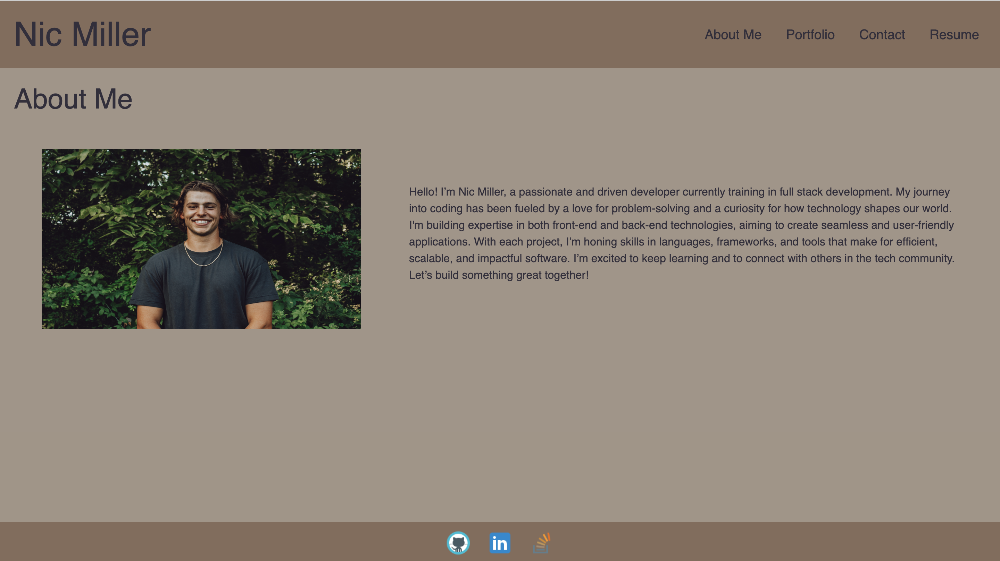

# 12-module-challenge

# Description
This project is a personal portfolio website designed to showcase my skills, experience, and projects as a full stack developer in training. The portolio contains an about me, contact, resume, and project section. This portfolio project was built using React and features responsive design, making it accessible and visually appealing across devices.
## Table of Contents
- [Insallation](#installation)
- [Usage](#usage)
- [Contribution](#contribution)
- [Tests](#tests)
- [Questions](#questions)
## Usage

- <https://github.com/NicMiller35/12-module-challenge>
- <https://stellar-alpaca-8f0ab7.netlify.app/>
## Contribution
Nic Miller

## License
This is licensed under <https://opensource.org/licenses/MIT>
## Questions
If you have questions you can reach me at my GitHub or email below.
- <https://github.com/NicMiller35>
- nicmiller13@gmail.com